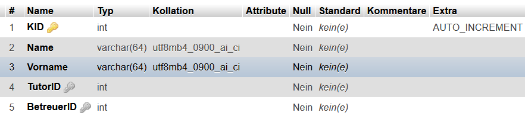

# JavaORM
Javabasiertes ORM-Projekt für MySQL-Datenbanken.

1. [Zusammenfassung](#javaorm)
2. [Was ist ORM?](#objekt-relationales-modell)
3. [Entitätsmengenobjekte](#enittsmengenobjekte)
   1. [Objektattribute und Tabellenspalten](#objektattribute-und-tabellenspalten)

## Objekt-Relationales Modell

Das objektrelationale Modell **(ORM)** ist ein Datenbankmodell,
das die verfügbaren Datenbankrelationen als Objekte im Programm
abbildet.

So ist es möglich, schnell und gezielt auf benötigte Daten zuzugreifen,
diese zu modifizieren und abzuspeichern. Es ist nicht mehr notwendig, darüber
nachzudenken, welche Relationen mit welchen Spalten in der Datenbank existieren,
da die Objekte der Entitätsmengen bereits klar vorgeben, was in welcher Form wo
gespeichert wurde oder werden kann.


## Enitätsmengenobjekte

Objekte der Datenbankrelation **"Kollegiat"** haben folgende Form:

````java
package entity;

import core.model.AbstractEntity;

public class Kollegiat extends AbstractEntity {

    protected int KID;
    protected String Name;
    protected String Vorname;
    protected int TutorID;
    protected int BetreuerID;

    public int getKID() {
        return KID;
    }
    
    // ...

    public void setTutorID(int tutorID) {
        TutorID = tutorID;
    }

    public int getBetreuerID() {
        return BetreuerID;
    }

    public void setBetreuerID(int betreuerID) {
        BetreuerID = betreuerID;
    }
}
````
### Objektattribute und Tabellenspalten

Das Framework ist so ausgelegt, dass nur Attribute mit dem Modifier ``protected`` für das ORM
in Betracht gezogen werden. Attribute mit der Sichtbarkeit ``public`` oder ``private`` werden
nicht berücksichtigt und können für interne Zwecke verwendet werden.

````java
package entity;

import core.model.AbstractEntity;

public class Kollegiat extends AbstractEntity {

    protected int KID;
    protected String Name;
    protected String Vorname;
    protected int TutorID;
    protected int BetreuerID;
        
    // ...

}
````

Hier liegen genau fünf ``protected``-Attribute vor. Ihr Pendant in der Datenbank sieht
folgendermaßen aus:



Nun wird erkennbar, was das objektrelationale Modell ausmacht. Was das im Detail für
Auswirkungen hat, wird im weiten Verlauf erläutert.


